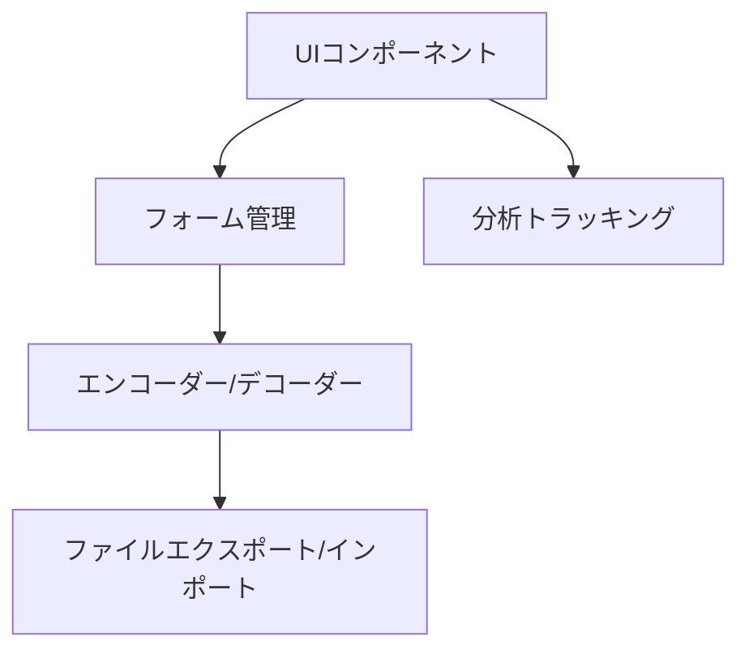
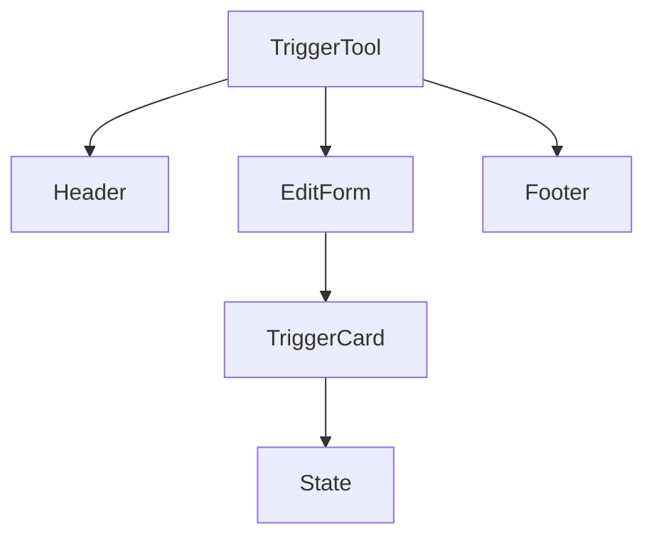
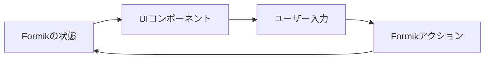
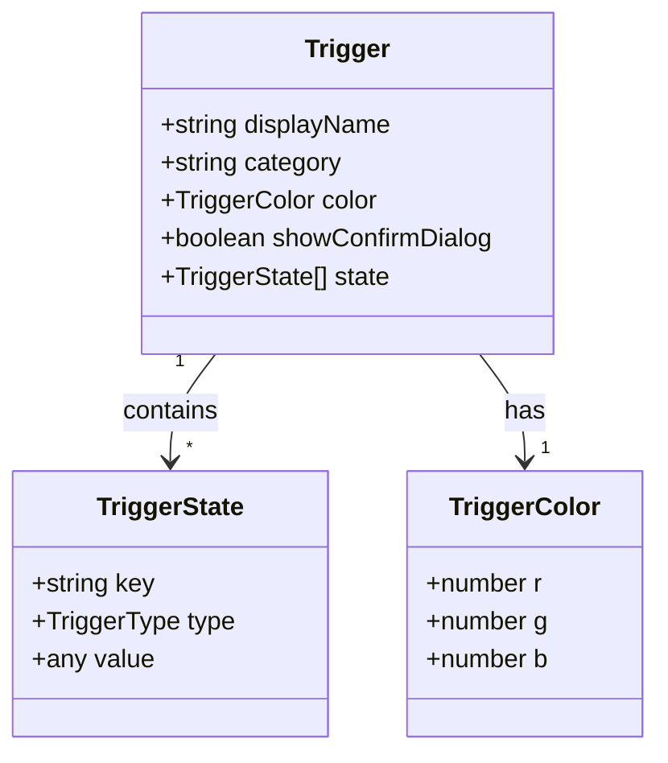

# システムパターン: Cluster Trigger Tool

## アーキテクチャ概要
Cluster Trigger Toolは、Next.jsをベースにしたシングルページアプリケーション（SPA）として構築されています。アプリケーションは以下の主要な層で構成されています：

## コンポーネント構造
アプリケーションは、以下のような階層的なコンポーネント構造を持っています：

1. **TriggerTool**: アプリケーションのルートコンポーネント
2. **Header**: アプリケーションのヘッダー
3. **EditForm**: トリガー編集フォームのコンテナ
4. **Footer**: アプリケーションのフッター
5. **TriggerCard**: 個々のトリガーを表示・編集するカード
6. **State**: トリガーの状態（state）を表示・編集するコンポーネント

## データフロー
アプリケーションのデータフローは、Formikを使用した単方向データフローに基づいています：

1. Formikが管理する状態がUIコンポーネントにレンダリングされる
2. ユーザーがUIを通じて入力を行う
3. 入力イベントがFormikアクションをトリガーする
4. Formikアクションが状態を更新し、UIが再レンダリングされる

## 主要なデザインパターン

### コンポジションパターン
UIコンポーネントは、小さな再利用可能なコンポーネントから構成されています。例えば、TriggerCardはStateコンポーネントを複数含むことができます。

### プロパティドリルダウン
親コンポーネントから子コンポーネントへのプロパティの受け渡しを使用して、データと関数を下位コンポーネントに提供しています。

### フォームステート管理
Formikライブラリを使用して、複雑なフォーム状態とバリデーションを管理しています。これにより、フォームの状態管理が簡素化され、一貫性のあるユーザー体験が提供されます。

## データモデル
アプリケーションの中心的なデータモデルは、`Trigger`型と`TriggerState`型です：

## エンコーディング/デコーディング
JSONファイルとアプリケーションの内部データモデル間の変換は、専用のエンコーダー/デコーダー関数によって処理されます：

1. **triggersToTriggerJsonText**: 内部の`Trigger[]`オブジェクトをJSON文字列に変換
2. **triggerJsonTextToTriggers**: JSON文字列を内部の`Trigger[]`オブジェクトに変換

## イベントトラッキング
ユーザーのアクションは、分析のために追跡されます。主要なユーザーアクションには、以下が含まれます：

- トリガーの追加/削除/移動/複製
- 状態の追加/削除/移動/複製
- JSONのインポート/エクスポート
